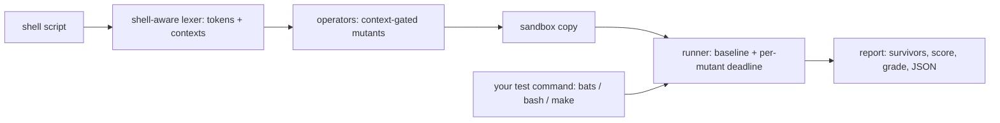

# mutash

[English](README.md) | [中文](README.zh.md) | [日本語](README.ja.md)

[](LICENSE) [](Cargo.toml)  [](CONTRIBUTING.md)

**シェルスクリプトのためのオープンソース・ミューテーションテスト——演算子とフラグをトークン単位で反転し、各ミュータントに bats テストを実行、殺せた数でテストスイートを採点する。**


```bash
git clone https://github.com/JaydenCJ/mutash.git && cargo install --path mutash
```

## なぜ mutash？

シェルスクリプトはデプロイ、マイグレーション、リリースゲートを担っているのに、ほとんどのリポジトリで最もテストされていないコードです——bats スイートがあったとしても、反転した `-lt` や脱落した `rm -rf` のフラグ、`exit 0` に化けた `exit 1` を本当に捕まえられるのか、誰にも分かりません。ミューテーションテストはまさにその問いに答えますが、既存のツールはすべて解析可能な AST を持つ言語だけを対象とし、bash に触れたものはありません。mutash はシェルのために作られた初のミューテーションテスターです：シェル文法を理解するトークンスキャナ（クォート、ヒアドキュメント、コメント、`$(( ))` 算術、テスト文脈）が bash の AST 構築もインタプリタへのパッチもなしに意味的に制御されたミュータントを生成し、使い捨てサンドボックス内で各ミュータントに対して*任意の*テストコマンドを実行し、生存者を file:line:col と該当ソース行つきで報告します。

|  | mutash | shellcheck | mutmut | Stryker |
|---|---|---|---|---|
| シェルスクリプト対応 | あり——同種初 | あり | なし（Python） | なし（JS/TS/C#/Scala） |
| 採点の対象 | あなたの*テスト* | コードスタイル | テスト | テスト |
| 解析アプローチ | トークン単位・文脈制御 | 完全な AST | Python AST | 言語別 AST |
| テストランナー | 任意のコマンド（`bats`、素の bash、`make test`） | 対象外 | pytest | フレームワーク別ランナー |
| 境界ミュータント（`-lt` → `-le`） | あり | 対象外 | あり | あり |
| 無限ループ化ミュータントの処理 | ベースライン由来のデッドライン | 対象外 | タイムアウト | タイムアウト |
| ランタイム依存 | ゼロ——std のみの単一バイナリ | Haskell バイナリ | Python + ライブラリ | Node + npm ツリー |

## 特徴

- **スタイルではなくスイートを採点**——毎回の実行はミューテーションスコアと文字グレード（`A+` … `F`）で締めくくられ、`--min-score 90` で意味のある終了コードを持つマージゲートになります。
- **bash の AST もインタプリタパッチも不要**——保守的なシェル対応スキャナが生きたトークンとその文脈（`[ ]`、`[[ ]]`、`$(( ))`、引数位置）を特定します。「誰も完全に構文解析できない言語」でミューテーションを成立させる要がここにあります。
- **文脈制御された 9 種の演算子**——比較、単項ファイル/文字列テスト、`&&`/`||`、算術、整数境界、終了ステータス、コマンドフラグ、否定、`true`/`false`。どの置換も構文的に妥当なまま保たれるよう設計されています。
- **実バグを掘り当てる境界ミュータント**——`-lt` は `-le` に、`200` は `199`/`201` に：正確な境界値を突くテストだけが殺せるミュータントであり、シェルの off-by-one はまさにそこに潜んでいます。
- **作業ツリーには一切触れない**——プロジェクトは一時サンドボックスへ一度だけコピーされ、各ミュータントが 1 ファイルを書き換えてテストを走らせ、元に戻します。無限ループ化したミュータントは実測ベースラインから導いたデッドラインで打ち切られます。
- **ミューテーションがノイズになる場所には逃げ道を**——ソース内の `# mutash: skip` / `off` / `on` プラグマ、コマンドラインの `--only` / `--skip` による演算子選択、ツール向けに安定した `--json` レポート。

## クイックスタート

インストール（Rust 1.75+ が必要。ビルドされたバイナリのランタイム依存はゼロ）：

```bash
git clone https://github.com/JaydenCJ/mutash.git && cargo install --path mutash
```

同梱の例で実行——一見まともなスイートを持つデプロイスクリプトです：

```bash
cd mutash/examples
mutash run deploy.sh --tests "bash tests/run.sh"   # or: --tests "bats tests/deploy.bats"
```

実際にキャプチャした出力（中間部を省略）：

```text
mutash 0.1.0 — mutation run
  tests:    bash tests/run.sh
  target:   deploy.sh (35 mutants)
  baseline: pass in 0.10s (per-mutant timeout: 2.3s)

  #1    deploy.sh:8:5            flag        drop `-u`              => killed (0.08s)
  #10   deploy.sh:27:30          compare     `-lt` -> `-le`         => killed (0.05s)
  #13   deploy.sh:33:22          compare     `-le` -> `-lt`         => survived (0.10s)
  #15   deploy.sh:37:24          arith       `+` -> `-`             => timeout (2.32s)
  ...

Survivors (4):

  #13  deploy.sh:33:22  compare  `-le` -> `-lt`
      > while [ "$attempt" -le "$MAX_ATTEMPTS" ]; do

  #34  deploy.sh:68:12  exit  `1` -> `0`
      > return 1

Score: 88.6%  (31/35 detected: 29 killed, 4 survived, 2 timeout, 0 error)   Grade: B
```

生存者の一つひとつが実行可能な改善点です：リトライ回数を固定するテストがなく、「検証を通過した後に失敗する」デプロイを試すテストもありません。何も実行せずにミュータントを下見したり、マージチェックで下限を強制したりできます：

```bash
mutash list deploy.sh --only compare,exit
mutash run deploy.sh --tests "bats tests/deploy.bats" --min-score 90   # exit 1 below 90%
```

## ミューテーション演算子

9 種の演算子はいずれもスキャナがトークンに付与した文脈で制御されます——設計理由つきの完全な表は [docs/operators.md](docs/operators.md) を参照。

| ID | 文脈 | 例 |
|---|---|---|
| `compare` | `[ ]`、`[[ ]]`、`test`、`$(( ))` | `-eq` → `-ne`、`-lt` → `-le`、`<` → `<=` |
| `unary` | `[ ]`、`[[ ]]`、`test` | `-z` → `-n`、`-f` → `-d`、`-r` → `-w` |
| `connective` | コマンドリストと `[ ]` | `&&` → `\|\|`、`-a` → `-o` |
| `arith` | `$(( ))`、`(( ))` | `+` → `-`、`*` → `/`、`++` → `--` |
| `number` | `[ ]`、`[[ ]]`、`$(( ))` | `3` → `4`、`3` → `2`、`0` → `1` |
| `exit` | `exit` / `return` ステータス | `exit 1` → `exit 0` |
| `flag` | コマンド引数 | `-rf` → `-r`、`-q` の削除、`--force` の削除 |
| `negate` | コマンド・テスト位置 | `!` の削除 |
| `truth` | コマンド位置 | `true` → `false` |

クォート内文字列、コメント、ヒアドキュメント本体、エスケープは決して変異されません。`# mutash: skip` の行（または `# mutash: off` / `# mutash: on` で挟んだブロック）は生成段階で除外されます。

## オプション

| Key | デフォルト | 効果 |
|---|---|---|
| `--tests <CMD>` | `bats tests` | ミュータントごとに `sh -c` 経由で実行するテストコマンド、cwd = サンドボックスのルート |
| `--root <DIR>` | `.` | サンドボックスへコピーするプロジェクトルート（スクリプトはその内部に置く） |
| `--timeout <SECS>` | 3× ベースライン + 2s | ミュータントごとのデッドライン。超過は検出扱い（`timeout`） |
| `--min-score <PCT>` | オフ | ミューテーションスコアがこの値を下回ると終了コード 1 |
| `--only <OPS>` / `--skip <OPS>` | 全演算子 | カンマ区切りの演算子 id を有効化 / 無効化 |
| `--json` | オフ | stdout に安定した機械可読レポートを出力（`run`・`list` 両対応）、進捗行を抑制 |

終了コード：`0` 成功、`1` スコアが `--min-score` 未満、`2` 使い方または環境のエラー（ミューテーション前にベースラインが失敗した場合を含む——mutash は赤いスイートの採点を拒否します）。

## アーキテクチャ



## ロードマップ

- [x] コアエンジン：シェル対応レキサ、文脈制御 9 演算子、ベースライン由来デッドラインのサンドボックスランナー、スコア/グレードつき生存者レポート、`--json`、プラグマ、`--min-score` ゲート
- [ ] N 個のサンドボックスコピーによる並列ミュータント実行（`--jobs`）
- [ ] インクリメンタル実行：指定した git ref 以降に変更された行だけを変異
- [ ] ミュータント網羅ヒント：各ミュータントを殺したテストへの対応づけ
- [ ] `zsh` テスト式方言（`[[ ]]` 拡張）

完全なリストは [open issues](https://github.com/JaydenCJ/mutash/issues) を参照。

## コントリビュート

コントリビューション歓迎——[CONTRIBUTING.md](CONTRIBUTING.md) を読み、[good first issue](https://github.com/JaydenCJ/mutash/issues?q=is%3Aissue+is%3Aopen+label%3A%22good+first+issue%22) から始めるか、[discussion](https://github.com/JaydenCJ/mutash/discussions) を立ててください。

## ライセンス

[MIT](LICENSE)
