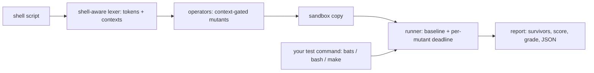

# mutash

[English](README.md) | [中文](README.zh.md) | [日本語](README.ja.md)

[](LICENSE) [](Cargo.toml)  [](CONTRIBUTING.md)

**Open-source mutation testing for shell scripts — flips operators and flags token-by-token, runs your bats tests against every mutant, and grades the suite by what it kills.**


```bash
git clone https://github.com/JaydenCJ/mutash.git && cargo install --path mutash
```

## Why mutash?

Shell scripts run your deploys, migrations and release gates, yet they are the least-tested code in most repositories — and even where a bats suite exists, nobody knows whether it would actually catch a flipped `-lt`, a dropped `rm -rf` flag or an `exit 1` that became `exit 0`. Mutation testing answers exactly that question, but every existing mutation tool targets a language with a parseable AST; none of them touch bash. mutash is the first mutation tester built for shell: a shell-aware token scanner (quotes, heredocs, comments, `$(( ))` arithmetic, test contexts) generates semantically-gated mutants with no bash AST and no interpreter patching, runs *any* test command against each one in a disposable sandbox, and reports the survivors with file:line:col and the exact source line.

|  | mutash | shellcheck | mutmut | Stryker |
|---|---|---|---|---|
| Targets shell scripts | yes — first of its kind | yes | no (Python) | no (JS/TS/C#/Scala) |
| What it grades | your *tests* | your code style | your tests | your tests |
| Parsing approach | token-level, context-gated | full AST | Python AST | language AST |
| Test runner | any command (`bats`, plain bash, `make test`) | n/a | pytest | framework runners |
| Boundary mutants (`-lt` → `-le`) | yes | n/a | yes | yes |
| Infinite-loop mutants handled | deadline derived from baseline | n/a | timeout | timeout |
| Runtime dependencies | none — one std-only binary | Haskell binary | Python + libs | Node + npm tree |

## Features

- **Grades your suite, not your style** — every run ends in a mutation score and a letter grade (`A+` … `F`); `--min-score 90` turns it into a merge gate with a meaningful exit code.
- **No bash AST, no interpreter patching** — a conservative shell-aware scanner finds live tokens and their context (`[ ]`, `[[ ]]`, `$(( ))`, argument position), which is what makes mutation viable for a language nobody can fully parse.
- **Nine context-gated operators** — comparisons, unary file/string tests, `&&`/`||`, arithmetic, integer boundaries, exit statuses, command flags, negation and `true`/`false`; each swap is designed to stay syntactically valid.
- **Boundary mutants that find real bugs** — `-lt` becomes `-le`, `200` becomes `199`/`201`: killable only by a test that pins the exact boundary, which is precisely where shell off-by-ones live.
- **Your working tree is never touched** — the project is copied once into a temp sandbox; each mutant rewrites one file, runs the tests, and restores it. Infinite-loop mutants are cut off by a deadline derived from the measured baseline.
- **Escape hatches where mutation is noise** — `# mutash: skip` / `off` / `on` pragmas in the source, `--only` / `--skip` operator selection on the command line, and a stable `--json` report for tooling.

## Quickstart

Install (requires Rust 1.75+; the built binary has zero runtime dependencies):

```bash
git clone https://github.com/JaydenCJ/mutash.git && cargo install --path mutash
```

Run it on the bundled example — a deploy script with a decent-looking suite:

```bash
cd mutash/examples
mutash run deploy.sh --tests "bash tests/run.sh"   # or: --tests "bats tests/deploy.bats"
```

Real captured output (abridged from the middle):

```text
mutash 0.1.0 — mutation run
  tests:    bash tests/run.sh
  target:   deploy.sh (35 mutants)
  baseline: pass in 0.10s (per-mutant timeout: 2.3s)

  #1    deploy.sh:8:5            flag        drop `-u`              => killed (0.08s)
  #10   deploy.sh:27:30          compare     `-lt` -> `-le`         => killed (0.05s)
  #13   deploy.sh:33:22          compare     `-le` -> `-lt`         => survived (0.10s)
  #15   deploy.sh:37:24          arith       `+` -> `-`             => timeout (2.32s)
  ...

Survivors (4):

  #13  deploy.sh:33:22  compare  `-le` -> `-lt`
      > while [ "$attempt" -le "$MAX_ATTEMPTS" ]; do

  #34  deploy.sh:68:12  exit  `1` -> `0`
      > return 1

Score: 88.6%  (31/35 detected: 29 killed, 4 survived, 2 timeout, 0 error)   Grade: B
```

Each survivor is an actionable gap: nothing pins the retry count, and no test exercises a deploy that fails *after* validation. Preview mutants without running anything, or enforce a floor in your merge checks:

```bash
mutash list deploy.sh --only compare,exit
mutash run deploy.sh --tests "bats tests/deploy.bats" --min-score 90   # exit 1 below 90%
```

## Mutation operators

Nine operators, each gated on the context the scanner assigns to the token — full tables with rationale in [docs/operators.md](docs/operators.md).

| ID | Context | Examples |
|---|---|---|
| `compare` | `[ ]`, `[[ ]]`, `test`, `$(( ))` | `-eq` → `-ne`, `-lt` → `-le`, `<` → `<=` |
| `unary` | `[ ]`, `[[ ]]`, `test` | `-z` → `-n`, `-f` → `-d`, `-r` → `-w` |
| `connective` | lists and `[ ]` | `&&` → `\|\|`, `-a` → `-o` |
| `arith` | `$(( ))`, `(( ))` | `+` → `-`, `*` → `/`, `++` → `--` |
| `number` | `[ ]`, `[[ ]]`, `$(( ))` | `3` → `4`, `3` → `2`, `0` → `1` |
| `exit` | `exit` / `return` statuses | `exit 1` → `exit 0` |
| `flag` | command arguments | `-rf` → `-r`, drop `-q`, drop `--force` |
| `negate` | command and test position | drop `!` |
| `truth` | command position | `true` → `false` |

Quoted strings, comments, heredoc bodies and escapes are never mutated; lines marked `# mutash: skip` (or blocks between `# mutash: off` / `# mutash: on`) are excluded at generation time.

## Options

| Key | Default | Effect |
|---|---|---|
| `--tests <CMD>` | `bats tests` | Test command run per mutant via `sh -c`, cwd = sandbox root |
| `--root <DIR>` | `.` | Project root copied into the sandbox (scripts must live inside it) |
| `--timeout <SECS>` | 3× baseline + 2s | Per-mutant deadline; overruns count as detected (`timeout`) |
| `--min-score <PCT>` | off | Exit 1 when the mutation score falls below this |
| `--only <OPS>` / `--skip <OPS>` | all operators | Comma-separated operator ids to enable / disable |
| `--json` | off | Stable machine-readable report on stdout (`run` and `list`), progress suppressed |

Exit codes: `0` success, `1` score below `--min-score`, `2` usage or setup error (including a baseline that fails before any mutation — mutash refuses to grade a red suite).

## Architecture



## Roadmap

- [x] Core engine: shell-aware lexer, nine context-gated operators, sandboxed runner with baseline-derived deadlines, survivor report with score/grade, `--json`, pragmas, `--min-score` gate
- [ ] Parallel mutant execution across N sandbox copies (`--jobs`)
- [ ] Incremental runs: only mutate lines changed since a given git ref
- [ ] Mutant coverage hints: map each mutant to the test that killed it
- [ ] `zsh` test-expression dialect (`[[ ]]` extensions)

See the [open issues](https://github.com/JaydenCJ/mutash/issues) for the full list.

## Contributing

Contributions are welcome — see [CONTRIBUTING.md](CONTRIBUTING.md), start with a [good first issue](https://github.com/JaydenCJ/mutash/issues?q=is%3Aissue+is%3Aopen+label%3A%22good+first+issue%22) or open a [discussion](https://github.com/JaydenCJ/mutash/discussions).

## License

[MIT](LICENSE)
