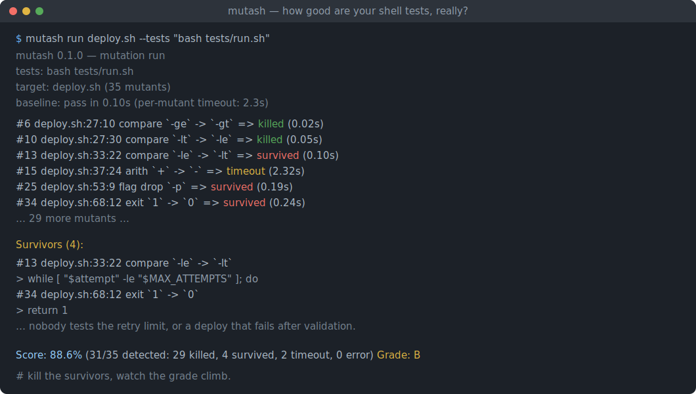
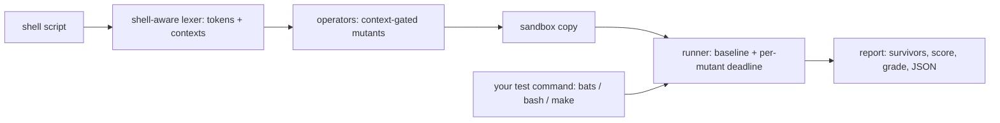

# mutash

[English](README.md) | [中文](README.zh.md) | [日本語](README.ja.md)

[](LICENSE) [](Cargo.toml)  [](CONTRIBUTING.md)

**开源的 shell 脚本变异测试工具——逐 token 翻转运算符和命令行 flag，对每个变异体运行你的 bats 测试，并按杀死的变异体数量给测试套件打分。**



```bash
git clone https://github.com/JaydenCJ/mutash.git && cargo install --path mutash
```

## 为什么选 mutash？

Shell 脚本承担着部署、迁移和发布关卡，却是大多数仓库里测试最少的代码——即便有 bats 套件，也没人知道它是否真能抓住被翻转的 `-lt`、被丢掉的 `rm -rf` flag，或是变成了 `exit 0` 的 `exit 1`。变异测试回答的正是这个问题，但现有的每一款变异工具都只针对拥有可解析 AST 的语言，没有一款碰过 bash。mutash 是第一个为 shell 而生的变异测试器：一个理解 shell 语法的 token 扫描器（引号、heredoc、注释、`$(( ))` 算术、测试上下文）在不构建 bash AST、不修补解释器的前提下生成语义受控的变异体，在一次性沙箱里对每个变异体运行*任意*测试命令，并以 file:line:col 加确切源代码行的形式报告幸存者。

|  | mutash | shellcheck | mutmut | Stryker |
|---|---|---|---|---|
| 面向 shell 脚本 | 是——同类首创 | 是 | 否（Python） | 否（JS/TS/C#/Scala） |
| 打分对象 | 你的*测试* | 你的代码风格 | 你的测试 | 你的测试 |
| 解析方式 | token 级、上下文受控 | 完整 AST | Python AST | 语言 AST |
| 测试运行器 | 任意命令（`bats`、纯 bash、`make test`） | 不适用 | pytest | 各框架 runner |
| 边界变异体（`-lt` → `-le`） | 有 | 不适用 | 有 | 有 |
| 死循环变异体的处理 | 由基线推导出的时限 | 不适用 | 超时 | 超时 |
| 运行时依赖 | 零——一个纯 std 二进制 | Haskell 二进制 | Python + 库 | Node + npm 依赖树 |

## 特性

- **给套件打分，而不是给风格打分**——每次运行都以变异得分和字母等级（`A+` … `F`）收尾；`--min-score 90` 让它变成带有效退出码的合并关卡。
- **不建 bash AST，不修补解释器**——保守的 shell 感知扫描器找出活跃 token 及其上下文（`[ ]`、`[[ ]]`、`$(( ))`、参数位置），这正是让"没人能完整解析的语言"也能做变异测试的关键。
- **九种上下文受控的操作符**——比较、一元文件/字符串测试、`&&`/`||`、算术、整数边界、退出状态、命令 flag、取反和 `true`/`false`；每种替换都被设计为保持语法合法。
- **能发现真实 bug 的边界变异体**——`-lt` 变成 `-le`，`200` 变成 `199`/`201`：只有钉住确切边界值的测试才能杀死它们，而 shell 的 off-by-one 恰好就藏在那里。
- **绝不触碰你的工作区**——项目只被复制一次到临时沙箱；每个变异体改写一个文件、跑完测试再还原。死循环变异体由基于实测基线推导的时限切断。
- **在变异只是噪音的地方留有出口**——源码内的 `# mutash: skip` / `off` / `on` 注释指令、命令行上的 `--only` / `--skip` 操作符筛选，以及供工具消费的稳定 `--json` 报告。

## 快速上手

安装（需要 Rust 1.75+；构建出的二进制零运行时依赖）：

```bash
git clone https://github.com/JaydenCJ/mutash.git && cargo install --path mutash
```

在自带示例上运行——一个配有看似不错的测试套件的部署脚本：

```bash
cd mutash/examples
mutash run deploy.sh --tests "bash tests/run.sh"   # or: --tests "bats tests/deploy.bats"
```

真实抓取的输出（中段有删节）：

```text
mutash 0.1.0 — mutation run
  tests:    bash tests/run.sh
  target:   deploy.sh (35 mutants)
  baseline: pass in 0.10s (per-mutant timeout: 2.3s)

  #1    deploy.sh:8:5            flag        drop `-u`              => killed (0.08s)
  #10   deploy.sh:27:30          compare     `-lt` -> `-le`         => killed (0.05s)
  #13   deploy.sh:33:22          compare     `-le` -> `-lt`         => survived (0.10s)
  #15   deploy.sh:37:24          arith       `+` -> `-`             => timeout (2.32s)
  ...

Survivors (4):

  #13  deploy.sh:33:22  compare  `-le` -> `-lt`
      > while [ "$attempt" -le "$MAX_ATTEMPTS" ]; do

  #34  deploy.sh:68:12  exit  `1` -> `0`
      > return 1

Score: 88.6%  (31/35 detected: 29 killed, 4 survived, 2 timeout, 0 error)   Grade: B
```

每个幸存者都是一个可执行的改进项：没有测试钉住重试次数，也没有测试覆盖"通过校验之后才失败"的部署。不执行任何测试地预览变异体，或在合并检查里强制一条底线：

```bash
mutash list deploy.sh --only compare,exit
mutash run deploy.sh --tests "bats tests/deploy.bats" --min-score 90   # exit 1 below 90%
```

## 变异操作符

九种操作符，每种都受扫描器为 token 标注的上下文约束——完整表格与设计理由见 [docs/operators.md](docs/operators.md)。

| ID | 上下文 | 示例 |
|---|---|---|
| `compare` | `[ ]`、`[[ ]]`、`test`、`$(( ))` | `-eq` → `-ne`、`-lt` → `-le`、`<` → `<=` |
| `unary` | `[ ]`、`[[ ]]`、`test` | `-z` → `-n`、`-f` → `-d`、`-r` → `-w` |
| `connective` | 命令列表与 `[ ]` | `&&` → `\|\|`、`-a` → `-o` |
| `arith` | `$(( ))`、`(( ))` | `+` → `-`、`*` → `/`、`++` → `--` |
| `number` | `[ ]`、`[[ ]]`、`$(( ))` | `3` → `4`、`3` → `2`、`0` → `1` |
| `exit` | `exit` / `return` 状态码 | `exit 1` → `exit 0` |
| `flag` | 命令参数 | `-rf` → `-r`、去掉 `-q`、去掉 `--force` |
| `negate` | 命令与测试位置 | 去掉 `!` |
| `truth` | 命令位置 | `true` → `false` |

引号内字符串、注释、heredoc 正文和转义永远不会被变异；标注了 `# mutash: skip` 的行（或 `# mutash: off` / `# mutash: on` 之间的块）在生成阶段即被排除。

## 选项

| Key | 默认值 | 效果 |
|---|---|---|
| `--tests <CMD>` | `bats tests` | 每个变异体经 `sh -c` 运行的测试命令，cwd = 沙箱根目录 |
| `--root <DIR>` | `.` | 被复制进沙箱的项目根目录（脚本必须位于其内） |
| `--timeout <SECS>` | 3× 基线 + 2s | 单变异体时限；超时按已检出计（`timeout`） |
| `--min-score <PCT>` | 关闭 | 变异得分低于该值时以退出码 1 结束 |
| `--only <OPS>` / `--skip <OPS>` | 全部操作符 | 逗号分隔的操作符 id，启用 / 禁用 |
| `--json` | 关闭 | stdout 输出稳定的机器可读报告（`run` 与 `list` 均支持），抑制进度行 |

退出码：`0` 成功，`1` 得分低于 `--min-score`，`2` 用法或环境错误（包括变异开始前基线就失败——mutash 拒绝给红色的套件打分）。

## 架构



## 路线图

- [x] 核心引擎：shell 感知词法扫描、九种上下文受控操作符、基线推导时限的沙箱运行器、含得分/等级的幸存者报告、`--json`、注释指令、`--min-score` 关卡
- [ ] 跨 N 份沙箱副本的并行变异执行（`--jobs`）
- [ ] 增量运行：只变异自某个 git ref 以来改动过的行
- [ ] 变异体覆盖提示：把每个变异体映射到杀死它的测试
- [ ] `zsh` 测试表达式方言（`[[ ]]` 扩展）

完整列表见 [open issues](https://github.com/JaydenCJ/mutash/issues)。

## 参与贡献

欢迎贡献——请阅读 [CONTRIBUTING.md](CONTRIBUTING.md)，从一个 [good first issue](https://github.com/JaydenCJ/mutash/issues?q=is%3Aissue+is%3Aopen+label%3A%22good+first+issue%22) 入手，或发起一个 [discussion](https://github.com/JaydenCJ/mutash/discussions)。

## 许可证

[MIT](LICENSE)
